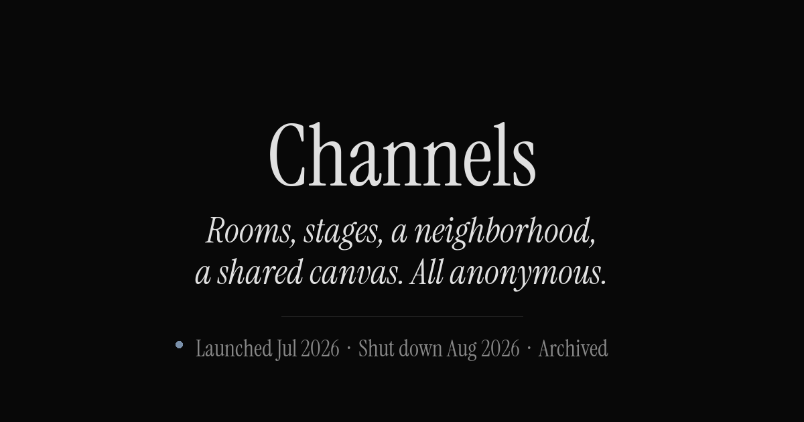
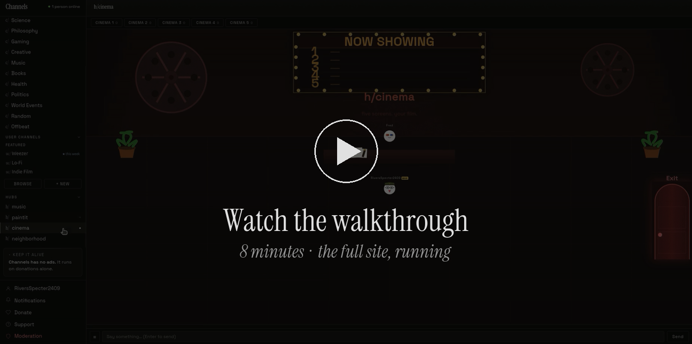
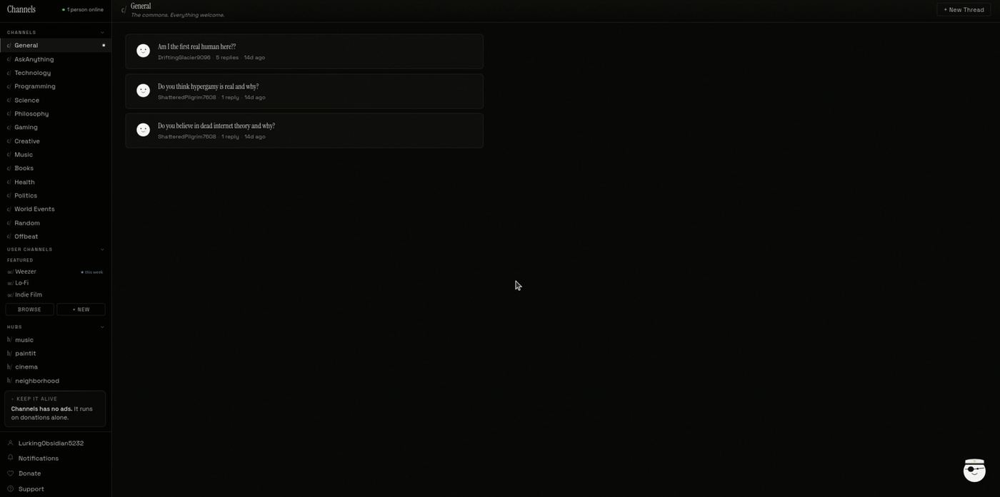
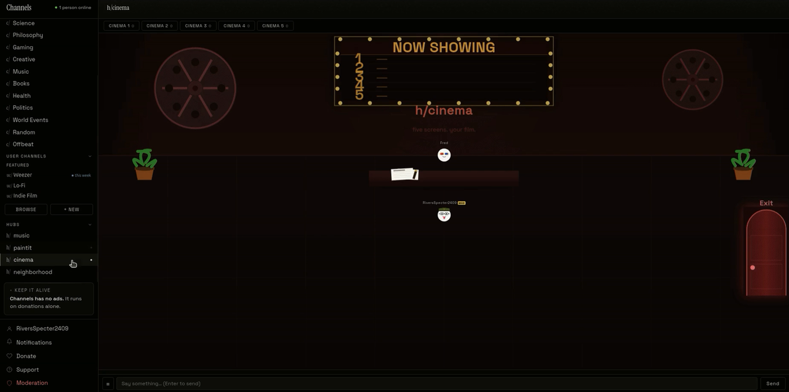

<div align="center">



### A privacy-first anonymous forum and real-time virtual world

Built solo in roughly four months. Launched 5 July 2026 at `channels.zone`. Shut down August 2026.

<br>


**[Live page](https://phoque52.github.io/channels-demo)** · **[Walkthrough](https://youtu.be/6gTw8FKWJUM)** · [Why it ended](#why-it-ended)

</div>

<br>

<div align="center">

[](https://youtu.be/6gTw8FKWJUM)

<sub>Eight minutes through the live site: hub stages, cinema rooms, the shared canvas and the neighborhood.</sub>

</div>

<br>

> [!NOTE]
> **About this repository.** It holds the preserved landing page only: `index.html`, its stylesheets, fonts and media.
> The application source (Express server, WebSocket hub, SQLite layer, client engine) is not published.
> Everything documented below describes a system that is no longer online.

<br>

## What it was

Most forum software is threads and replies. Channels was a forum attached to a world you could
walk through: persistent 2D rooms rendered in the browser, with audio, video and drawing
synchronized live between everyone present.

Four principles were fixed at the start and never relaxed. **No ads. No algorithm. No real name.
No investors.** Every decision downstream followed from them, including the ones that made the
project unsustainable.

<div align="center">

| | | | |
|:--|--:|:--|--:|
| **Server code** | ~2,650 lines | **Client code** | ~9,500 lines |
| **Database tables** | 13 | **WebSocket messages** | 48 types |
| **Server tick** | 30 Hz | **Claimable homes** | 1,800 |
| **Official channels** | 15 | **Time live** | 6 weeks |

</div>

<br>

## The forum



<sub>Fifteen official channels under `c/`, user-created channels under `uc/`, two per account per day.
Threads support `@mention` autocomplete. Everything soft-deleted, so moderation stays reversible.</sub>

<!-- INLINE VIDEO SLOT 1
     To make this play inline: edit this file on github.com, delete this comment block,
     and drag assets/channels.mp4 into the editor at this spot. GitHub uploads it and
     inserts a URL that renders as a real player. Limit is 10MB; this file is 1.8MB. -->

<br>

## The hubs



<sub>`h/cinema`, one of four hub spaces. Five rooms, one host, everyone else synchronized to the
host's timestamp. Avatars, NPCs and chat are live across the room.</sub>

<!-- INLINE VIDEO SLOT 2
     Same as above: drag assets/hubs.mp4 here (2.3MB) to get an inline player. -->

<br>

<table>
<tr>
<td width="50%" valign="top">

### `h/music`

Five stages. Six instruments: piano, guitar, bass, violin, saxophone, drums. Three simultaneous
performers per stage.

Instruments are **synthesized in the browser** with the Web Audio API, not sampled. Oscillators
through gain envelopes and biquad filters. No audio files ship to the client.

</td>
<td width="50%" valign="top">

### `h/cinema`

Five rooms. One participant hosts, the server holds authoritative playback state, and every other
client seeks to the host's timestamp.

Late arrivals join at the correct position instead of from the beginning.

</td>
</tr>
<tr>
<td width="50%" valign="top">

### `h/paintit`

A persistent 500x500 shared canvas. One pixel per user every 60 seconds, sixteen colors.

New arrivals get a snapshot, then live deltas.

</td>
<td width="50%" valign="top">

### `h/neighborhood`

Ten countries, fifteen cities each, twelve homes per city. **1,800 claimable homes.**

Addresses are generated from a page id rather than stored. Interiors are furnishable, access is
key-based, and an hourly job reclaims homes gone inactive.

</td>
</tr>
</table>

<br>

## Architecture

One Node process served everything: HTTP, static assets, and WebSocket world state. No
microservices, no message broker, no external cache. For the load this site realistically faced,
one process and one embedded database was the right call, and it kept the bill to a single small VPS.

```
                     ┌──────────────────────────────┐
   Browser ───TLS───▶ │  Caddy (reverse proxy, TLS)  │
                     └──────────────┬───────────────┘
                                    │
                     ┌──────────────▼───────────────┐
                     │      Node / Express 5        │
                     │                              │
                     │  compression → helmet (CSP)  │
                     │  → body parse → session      │
                     │  → CSRF origin check         │
                     │  → rate limiters → guards    │
                     │  → static → routers          │
                     └──────┬────────────────┬──────┘
                            │                │
                   ┌────────▼─────┐   ┌──────▼────────┐
                   │  HTTP routes │   │  ws server    │
                   │  (6 routers) │   │  30 Hz tick   │
                   └────────┬─────┘   └──────┬────────┘
                            │                │
                     ┌──────▼────────────────▼──────┐
                     │  better-sqlite3 (WAL mode)   │
                     │  app data + session store    │
                     └──────────────────────────────┘
```

<details>
<summary><b>Why the middleware order matters</b></summary>

<br>

Session initialisation precedes every route guard, so `req.session` is always populated.

Page guards are registered **before** `express.static`. Without that, static middleware serves
protected HTML directly and the guard never runs. It is an easy failure mode to introduce and a
hard one to notice, because the page looks fine while being completely unprotected.

**On synchronous database access.** `better-sqlite3` is synchronous, which in a single-threaded
runtime sounds alarming. In practice, queries against an embedded SQLite file complete in
microseconds, and the absence of promise overhead made the real-time loop simpler and more
predictable than an async driver would have.

</details>

<details>
<summary><b>Data model: 13 tables</b></summary>

<br>

Created idempotently at boot. Migrations are guarded `ALTER TABLE` statements wrapped in
`try/catch`, so the schema converges on startup regardless of which version last wrote the file.

| Table | Purpose |
|---|---|
| `users` | Username, Argon2id hashes, avatar JSON, bio, mod flag, ban timestamp |
| `channels` | Official (`c/`) and user-created (`uc/`) channels, soft-deleted |
| `threads` | Thread bodies, soft-deleted |
| `replies` | Replies, cascade-deleted with their thread |
| `mod_actions` | Append-only audit log of every moderator action |
| `notifications` | System and activity notifications |
| `notification_reads` | Per-user read state |
| `neighborhood_homes` | 1,800 home slots, ownership, expiry |
| `home_access` | Key-holder access lists per home |
| `home_furnishings` | Placed objects inside home interiors |
| `paintings` | Per-easel canvas images |
| `paintit_pixels` | The persistent shared canvas |
| `bug_reports` | In-app reports with status tracking |

Content is soft-deleted throughout, `deleted_at` rather than `DELETE`, so moderation stays
reversible and the audit log keeps meaning.

The official channel list is upserted from code on every boot, so editing a name or motto in the
source propagates without a migration.

</details>

<details>
<summary><b>Identity: no email, no recovery, eleven passitems</b></summary>

<br>

There is no email address, no phone number, no OAuth provider and no password reset. An account
is three generated artifacts:

1. **A username.** Adjective plus noun plus four digits, collision-checked with a bounded retry.
2. **A passphrase.** 16 bytes from `crypto.randomBytes`, base64url encoded.
3. **Eleven passitems.** Words drawn without replacement from a 180-word list.

All three are shown exactly once, during signup. The passphrase and the joined passitem string
are hashed with **Argon2id**, and the raw values leave the server the moment the final step
completes. Signing in needs the username, the passphrase, and all eleven passitems.

The consequence was stated plainly on the signup page: **lose the credentials and the account is
gone.** There is no recovery path because there is no second factor of identity to recover against.

**Timing-attack resistance.** When a username does not exist, sign-in still runs `argon2.verify`
against a hardcoded dummy hash before failing. Without it, an unknown user would return
measurably faster than a wrong password, and the endpoint would leak which usernames are registered.

**Sessions** are server-side in the same SQLite file, four-hour rolling expiry, cookie flagged
`httpOnly` and `sameSite=lax`, `secure` in production, swept every 15 minutes.

**Bans** are checked against the database on every authenticated request rather than trusted from
the session, so a ban lands on the user's next action instead of whenever their cookie expires.

</details>

<details>
<summary><b>Security controls</b></summary>

<br>

| Control | Implementation |
|---|---|
| Password hashing | Argon2id, raw values never persisted |
| Username enumeration | Dummy-hash verification on unknown users |
| Session storage | Server-side, SQLite-backed, 4h rolling, auto-swept |
| CSRF | Origin and host comparison on all state-changing methods |
| CSP | Strict `helmet` policy, YouTube explicitly allowlisted |
| SQL injection | Prepared statements throughout, `LIKE` wildcards escaped |
| Rate limiting | Per-endpoint: sign-in 10/15 min, signup 10/h, reports 5/h |
| Ban enforcement | Re-checked from the database on every request |
| Startup safety | Process refuses to boot without `SESSION_SECRET` |
| Transport | TLS terminated at Caddy, `trust proxy` scoped to one hop |

The CSRF check deliberately allows requests with no `Origin` header, or an opaque `null` origin,
since browsers send those for legitimate redirect chains and sandboxed contexts. It rejects any
origin whose hostname does not match the request host.

</details>

<details>
<summary><b>Privacy model</b></summary>

<br>

What the server stored: a generated username, two Argon2id hashes, content the user created, an
avatar configuration, and a server-side session token. Nothing connecting to a real identity.

**IP addresses were used only for rate limiting.** Counters lived in server memory and were never
written to an account record. No analytics package, no ad network, no tracking cookie, and no
third-party script beyond the YouTube embed the cinema hub required. Fonts were self-hosted
specifically to avoid leaking visitor requests to a font CDN.

This was stated on the front page in the same detail it is stated here, including its limits.

</details>

<br>

## Release history

| Version | Date | Highlights |
|:--|:--|:--|
| **v1.2** | never shipped | Home interiors rebuild, in progress when development stopped |
| **v1.1** | 13 Aug 2026 | Housing system, estate office, notification system |
| **v1.0** | 5 Jul 2026 | Mobile support, neighborhood, transportation, border guards, instruments |
| **v0.5** | 30 Jun 2026 | User profiles, hub lobbies, NPCs, spam prevention, free shared canvas |
| **v0.1** | 21 Jun 2026 | Initial release |

<br>

## Why it ended

**No revenue was possible by design.** The site's own pillars were no ads, no algorithm, no
investors, donations only. A product whose charter forbids revenue cannot be a business, and
cannot be taken to investors without breaking the promise on its own front page. It ran for six
weeks on a VPS paid out of pocket.

**Zero organic users after launch.** Not a marketing failure. Structural, with three causes:

<table>
<tr>
<td width="33%" valign="top">

**1. Nothing was visible from outside**

All threads, hubs and neighborhood content sat behind the signup wall. Nothing was indexable,
shareable, or evaluable before committing.

</td>
<td width="33%" valign="top">

**2. Signup was maximum friction**

Generated credentials, eleven words to write on paper, no recovery ever. Asked of a visitor who
had not yet seen a single post.

</td>
<td width="33%" valign="top">

**3. Real-time needs density**

Empty music stages and 1,800 empty homes are worse than not having the feature at all.

</td>
</tr>
</table>

Each was defensible in isolation. Together they made growth close to impossible.

<br>

## What I would do differently

**Make something public.** A read-only view of `c/` channels, indexable and shareable, would have
cost little privacy and given search engines something to point at. The signup wall protected
users who never arrived.

**Stage the friction.** Let someone read first and create an account second. Defer the
eleven-passitem ceremony until there is a reason to protect the account. The security model was
sound; presenting all of it before any value was the error.

**Seed density, or cut it.** Real-time features should have launched in one room at one announced
time, not across five stages and ten countries that were always empty.

**Use a CSPRNG everywhere.** The passphrase correctly uses `crypto.randomBytes`, but username and
passitem selection use `Math.random()`. Passitems are a credential factor and deserve the same
treatment. A real flaw, and one I would fix before this system ever held anything valuable.

**Decide the business model before the charter.** "No revenue" is coherent for a hobby. Writing it
onto the front page of something meant to last made it unfixable later without breaking a public
promise.

<br>

## Technology

<div align="center">

| Layer | Choice |
|:--|:--|
| Runtime | Node.js, Express 5 |
| Database | SQLite via `better-sqlite3`, WAL journaling |
| Real-time | `ws`, sharing the HTTP server port |
| Auth | `argon2` (Argon2id), `express-session` with a SQLite store |
| Security | `helmet`, `express-rate-limit`, custom origin-based CSRF |
| Client | Vanilla JavaScript, Canvas rendering, Web Audio API |
| Fonts | Instrument Serif, Space Grotesk, self-hosted |
| Infrastructure | Single VPS behind Caddy |

</div>

No bundler, no build step, no front-end framework. The client is plain ES served directly, and
the whole application ships as static files plus one Node process.

<br>

---

<div align="center">

Questions about how any of this was built are welcome.

**[channelssupport@proton.me](mailto:channelssupport@proton.me)**

<sub>Channels ran from 5 July to August 2026. Archived and documented for reference.</sub>

</div>
